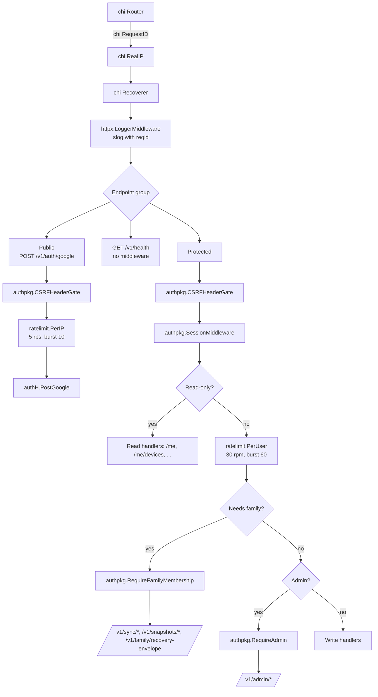
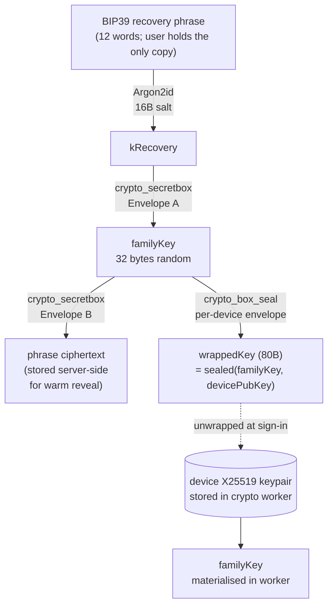
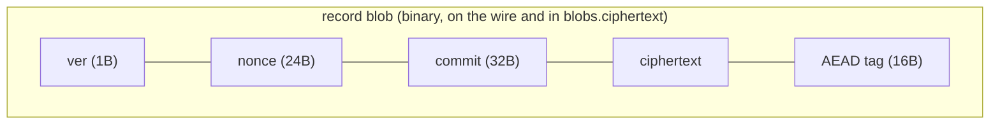
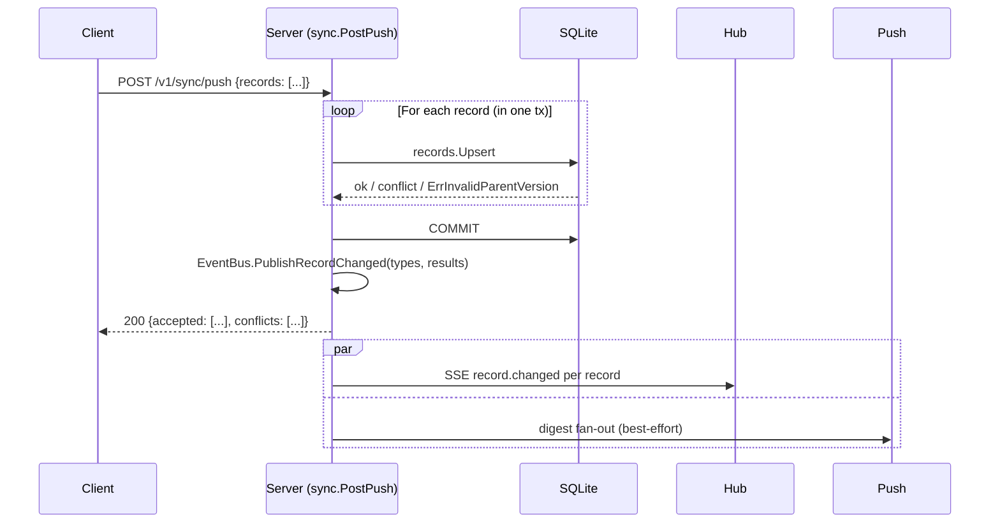
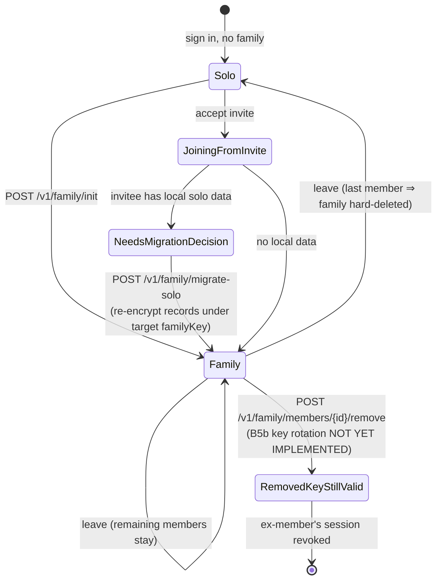
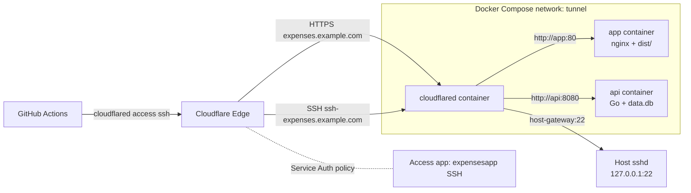

# Architecture

A single-source overview of the Expenses App: a React 19 PWA paired with a
Go 1.26 API that offers optional end-to-end encrypted family sync, Web Push,
and encrypted server snapshots. The PWA is fully usable offline; the backend
is invoked only when the user signs in with Google and chooses to enable
sync.

This document is a map of the system. It points into per-package docs rather
than duplicating their contents. When a code reference exists, the code wins
over any text here.

- Root project context: [CLAUDE.md](./CLAUDE.md)
- Frontend package: [src/services/CLAUDE.md](./src/services/CLAUDE.md),
  [src/db/CLAUDE.md](./src/db/CLAUDE.md), [src/components/CLAUDE.md](./src/components/CLAUDE.md),
  [src/hooks/CLAUDE.md](./src/hooks/CLAUDE.md), [src/utils/CLAUDE.md](./src/utils/CLAUDE.md).
- Backend package: [backend/CLAUDE.md](./backend/CLAUDE.md) plus per-internal-package files
  under [backend/internal/](./backend/internal/).
- Operations: [docs/deployment-setup.md](./docs/deployment-setup.md),
  [docs/design-notes/key-rotation.md](./docs/design-notes/key-rotation.md).

## 1. System overview

The frontend is a Vite-built PWA served as static assets behind nginx. The
backend is a Go service exposing a versioned REST/SSE API. Both run as
containers on a single home Ubuntu server. Cloudflare Tunnel terminates TLS
at the edge and forwards path-routed traffic over an outbound tunnel — the
server has no public IP. Web Push fans out from the backend through the
browser's push service (FCM/APNS) and is delivered by the PWA's service
worker.

```mermaid
flowchart LR
  subgraph Client["Browser / installed PWA"]
    direction TB
    UI[React UI]
    SW[Service Worker<br/>sw.ts + Workbox]
    Dexie[(Dexie / IndexedDB<br/>expenses-app-db v6)]
    Worker[Crypto Worker<br/>libsodium + argon2id]
    Outbox[(pendingUploads<br/>outbox)]
    UI <--> Dexie
    UI <--> Worker
    UI <--> Outbox
    SW --- UI
  end

  subgraph Edge["Cloudflare"]
    CFE[Cloudflare Edge<br/>TLS / WAF / DNS]
    CFT[cloudflared<br/>outbound tunnel]
    Access[Access service-token<br/>SSH gate]
  end

  subgraph Server["Home Ubuntu host"]
    direction TB
    Nginx[nginx<br/>static PWA]
    API[Go API<br/>chi + sqlc]
    DB[(SQLite WAL<br/>data.db)]
    Hub[live.Hub<br/>SSE fan-out]
    Jobs[jobs.JobRunner<br/>daily / minute]
  end

  Push["Browser push service<br/>(FCM / APNS)"]

  UI -- HTTPS / JSON --> CFE
  UI -- SSE / EventSource --> CFE
  CFE -- HTTP --> CFT
  CFT -- http://app:80 --> Nginx
  CFT -- http://api:8080 --> API
  Nginx --> UI
  API <--> DB
  API --- Hub
  API --- Jobs
  Hub -. SSE record.changed .-> UI
  API -- VAPID-signed POST --> Push
  Push -- push event --> SW
  SW -- Notification API --> UI

  GH[GitHub Actions runner] -- cloudflared access ssh --> Access
  Access -. service token .- CFE
  CFE -- tunneled SSH --> Server
```

Key properties:

- **Offline-first.** Every flow that doesn't fundamentally require the backend
  (record creation, edits, reports, budgets, backups) works without a session.
  Online mode only adds sync, push, and snapshots.
- **Zero-knowledge sync.** The backend persists opaque ciphertext + AAD
  metadata. AAD is byte-identical on client and server (golden vectors —
  see [backend/internal/crypto/CLAUDE.md](./backend/internal/crypto/CLAUDE.md)
  and [src/services/crypto/CLAUDE.md](./src/services/crypto/CLAUDE.md)).
- **Single writer.** SQLite is opened with `SetMaxOpenConns(1)` and
  `_txlock=immediate`; concurrent writes serialise without deadlocks. See
  [backend/internal/db/CLAUDE.md](./backend/internal/db/CLAUDE.md).
- **No inbound ports.** All ingress is via Cloudflare Tunnel; deploys SSH
  through Cloudflare Access. See
  [docs/deployment-setup.md](./docs/deployment-setup.md).

## 2. Frontend architecture

The PWA is a single React Router tree rendered into `index.html` by
`main.tsx`. The shell — `App.tsx` — runs DB integrity checks, hydrates the
settings store, and decides whether to redirect into onboarding before any
tab page mounts.

### 2.1 Page tree

```
/onboarding                           OnboardingFlow (sign-in → recovery → welcome → currency → account → categories)
/devices/waiting                      DeviceJoinWaiting (post-sign-in, awaiting envelope from peer device)
/recovery-code                        RecoveryCodePage (re-enter recovery phrase to unlock)
/dev/crypto-demo                      CryptoDemoPage (dev-only sandbox)

/                                     TabLayout
  /accounts                           AccountsPage
    /accounts/new                       sheet — AccountForm
    /accounts/:id                       sheet — AccountDetail
    /accounts/trash                     TrashedAccounts (full-screen)
  /categories                         CategoriesPage
    /categories/trash                   TrashedCategories (nested)
  /transactions                       TransactionsPage
    /transactions/new                   TransactionInput (lazy, full-screen)
    /transactions/:id/edit              TransactionInput (lazy, full-screen)
  /budget                             BudgetPage (lazy)
  /overview                           OverviewPage (lazy)

/settings                             SettingsPage (full-screen)
/admin                                AdminPage (full-screen, backend-gated)
```

See [src/components/CLAUDE.md](./src/components/CLAUDE.md) for the component
inventory per feature folder, and [src/hooks/CLAUDE.md](./src/hooks/CLAUDE.md)
for the reactive read API.

### 2.2 State stores

Three Dexie-backed sources of truth plus a small set of Zustand stores for
ephemeral UI:

| Layer                     | Owner                                  | Scope                                                                                                          |
| ------------------------- | -------------------------------------- | -------------------------------------------------------------------------------------------------------------- |
| Dexie `expenses-app-db`   | [src/db/CLAUDE.md](./src/db/CLAUDE.md) | Domain data: accounts, categories, transactions, budgets, settings, backups, logs, pendingUploads, syncCursors |
| Dexie `expenses-app-keys` | crypto worker IndexedDB                | Raw `familyKey`, device private key — never accessed from the main thread                                      |
| `useSettingsStore`        | `src/stores/settings-store.ts`         | Settings cache; hydrated at startup, written through to Dexie + `pushSetting()`                                |
| `useUiStore`              | `src/stores/ui-store.ts`               | Filters, selection, edit mode — resets on reload                                                               |
| `useSyncStore`            | `src/stores/sync-store.ts`             | Live sync status (`isSyncing`, last error, quota banner)                                                       |
| `useDeviceJoinStore`      | `src/stores/device-join-store.ts`      | Handshake state for new devices waiting on an envelope                                                         |
| `useAuthStore`            | `src/services/auth/session.ts`         | Signed-in user, device handle, `pendingDevicePubKey`, `awaitingEnvelope`                                       |

Reactive reads must go through the `useX` hooks in `src/hooks/`. Components
never query Dexie directly. Mutations to domain data MUST go through
`balance.service.ts` (the only writer of `Account.balance`) or through the
matching `push*` helper in `src/services/sync/push-helpers.ts`.

### 2.3 Sync engine call sites

`src/services/sync/push-helpers.ts` exposes per-record-type wrappers:
`pushTransaction`, `pushTransactionTombstone`, `pushAccount`, `pushCategory`,
`pushBudget`, `pushSetting`. Every domain write path imports one of these:

- `balance.service.ts` — `applyTransaction` / `updateTransaction` /
  `deleteTransaction` push the affected `Transaction` (and the tombstone
  variant on delete).
- `components/accounts/AccountForm.tsx`, `AccountDetail.tsx`,
  `TrashedAccounts.tsx` — push the `Account` after every save / restore.
- `components/categories/CategoryForm.tsx`, `CategoryList.tsx`,
  `TrashedCategories.tsx` — push the `Category` after every save / reorder /
  trash / restore.
- `components/budget/BudgetNumpad.tsx` — push the `Budget` on every save.
- `stores/settings-store.ts` — `pushSetting(key, value)` for every key in
  `SYNCED_SETTING_KEYS` (`mainCurrency`, `monthStartDay`).

Each helper:

1. Builds a `RawRecord` carrying `(familyId, recordId, recordType, addedBy,
editedBy, parentVersion, deletedAt, updatedAtMap, payload)`.
2. Calls `enqueuePush(record)` in `engine.ts`, which:
   - encrypts the plaintext via the crypto worker (`encryptRecordWithStoredKey`),
   - writes the resulting envelope to `db.pendingUploads`,
   - fires `flushOutbox()` if `navigator.onLine`.

Outbox flush, conflict merging, and pull are described in
[src/services/sync/CLAUDE.md](./src/services/sync/CLAUDE.md) and section 6 of
this document.

### 2.4 Crypto worker boundary

All raw key material lives inside the dedicated crypto Worker (`worker.ts`,
spawned by `worker-client.ts`). The worker maintains its own IndexedDB
(`expenses-app-keys`) — the main thread never sees the `familyKey` or device
private key bytes. RPCs always flow as plaintext-in → ciphertext-out (or the
reverse) via `postMessage`; explicit-key variants (`encryptRecord`,
`decryptRecord`) exist only for the migrate-solo path that unwraps a foreign
family key for a one-shot re-encrypt sweep.

The worker also computes pubkey fingerprints (13 base32 chars) for the
device-join TOFU banner. Argon2id and libsodium are loaded lazily via
`argon-init.ts` and `sodium-init.ts` (libsodium "sumo" build pinned via Vite
alias — do not switch to the lite build).

See [src/services/crypto/CLAUDE.md](./src/services/crypto/CLAUDE.md).

### 2.5 Service worker

`src/sw.ts` is built with Workbox InjectManifest. It owns:

- precaching the static PWA shell,
- runtime caching for the offline read path,
- the `push` event handler (decrypted display payload for digest
  notifications),
- the periodic-sync registration helpers used by
  `src/services/sync/background-sync.ts` to drain the outbox in the
  background when the platform supports it.

`sw-register.ts` mounts the worker on startup, manages the `beforeinstallprompt`
event for the PWA install banner, and surfaces a "new version available"
prompt via `use-sw-update.ts`.

## 3. Backend architecture

A single Go process (`backend/cmd/api/main.go`) opens a SQLite database,
constructs a single chi router via `internal/server.NewRouter`, and starts a
background `jobs.JobRunner`. Process-local concurrency is bounded by SQLite's
one-writer model.

### 3.1 Router and middleware chain



The canonical chain for any mutating, family-scoped endpoint is therefore:

```
CSRFHeaderGate → SessionMiddleware → PerUser → RequireFamilyMembership → handler
```

Reauth endpoints also add a `PerIP(5,10)` bucket on top of `PerUser` because
they accept opaque secrets. See
[backend/internal/auth/CLAUDE.md](./backend/internal/auth/CLAUDE.md) and
[backend/internal/ratelimit/CLAUDE.md](./backend/internal/ratelimit/CLAUDE.md).

Every protected handler reads identity from request context via
[backend/internal/httpx/CLAUDE.md](./backend/internal/httpx/CLAUDE.md)
(`httpx.UserID(ctx)`, `httpx.DeviceID(ctx)`, `httpx.FamilyID(ctx)`,
`httpx.SessionID(ctx)`, `httpx.RequestID(ctx)`).

### 3.2 Persistence

[backend/internal/db/CLAUDE.md](./backend/internal/db/CLAUDE.md) owns
`Open(ctx, path)`, which sets:

```
journal_mode=wal
synchronous=normal
busy_timeout=5000
foreign_keys=on
temp_store=memory
mmap_size=268435456
cache_size=-20000
_txlock=immediate
```

Goose migrations run synchronously inside `Open`:

- `00001_init.sql` — full initial schema (users, families, devices, sessions,
  envelopes, blobs, record_meta, snapshots, push, allowlist, audit_log).
- `00002_migrations.sql` — reconciles a development drift fix.
- `00003_support_logs.sql` — `support_logs` (client log uploads).
- `00004_session_previous_token_hash.sql` — adds the rotation grace window
  for session tokens (B4d).

All writes funnel through `WithTx(ctx, db, fn)` (begin / commit / rollback).
All queries are sqlc-generated from `internal/db/queries.sql` — hand-written
SQL outside that file is a smell.

### 3.3 sqlc

`backend/sqlc.yaml` configures generation into `internal/db/gen/`. Every
package consumes `gen.Queries` (the bound interface) or builds a per-tx
queries handle via `gen.New(tx)`. The generated layer is the only thing that
should know SQL column names; consumers see typed structs.

### 3.4 Background jobs

`internal/jobs.JobRunner.Start(ctx)` launches each job in its own goroutine;
panic recovery wraps every tick so one job's failure cannot bring down the
runner. See [backend/internal/jobs/CLAUDE.md](./backend/internal/jobs/CLAUDE.md):

| Job              | Schedule        | Owner               |
| ---------------- | --------------- | ------------------- |
| `snapshot_daily` | 03:00 UTC daily | `internal/snapshot` |
| `deletion_purge` | daily           | `internal/account`  |
| `digest_push`    | per-minute drip | `internal/push`     |
| `held_drainer`   | per-minute      | `internal/push`     |

Daily snapshots are idempotent on `(family_id, snapshot_date)`. Deletion
purge hard-deletes user rows whose `delete_after` has elapsed (14 day grace
window). Digest push coalesces `record.changed` notifications per-family.
Held drainer flushes notifications queued during quiet hours.

### 3.5 SSE hub

`internal/live.Hub` is an in-memory pub/sub registered per HTTP request.
Each subscriber registers under three scopes (`family:<id>`, `user:<id>`,
`device:<id>`) and reads from three channels. The hub is non-blocking — a
slow consumer is dropped after one warning rather than backing up other
clients.

The sync handler publishes only `record.changed` and `sync.barrier`. Other
event names (`family.changed`, `you.removed`, `device.joined`) are published
by the family and admin handlers. See section 6.4 for the full event table.

## 4. Data model

The frontend and backend hold materially different views of the same
records. The frontend stores fully-decrypted domain objects keyed by their
own UUIDs; the backend stores opaque ciphertext blobs keyed by `record_id`
plus a small AAD digest.

### 4.1 Dexie schema (frontend, currently at version 6)

[src/db/CLAUDE.md](./src/db/CLAUDE.md) is the source of truth. Current
tables (after B1's outbox + cursor and B5d's worker-only key storage):

```
accounts        ++id, type, name, isTrashed, currency
categories      ++id, type, name, isTrashed, displayOrder
transactions    ++id, date, accountId, categoryId, type, isTrashed,
                [date+displayOrder], [accountId+date], transferGroupId, toAccountId
budgets         ++id, categoryId, accountId, month,
                [categoryId+month], [accountId+month]
exchangeRates   ++id, baseCurrency, &[baseCurrency+date]
settings        key
backups         ++id, createdAt
logs            ++id, timestamp, level
cipherKeys      name           (legacy; main thread no longer reads/writes — see B5d)
pendingUploads  ++id, recordId, attempts
syncCursors     &familyId
```

All monetary amounts (`Account.balance`, `Transaction.amount`,
`Transaction.amountMainCurrency`, `Budget.plannedAmount`) are stored as
**minor units** (cents/pence). All datetime semantics follow:

- `Transaction.date` — `YYYY-MM-DD` local wall-clock.
- `Transaction.timestamp` — full UTC RFC3339-ms ISO string.
- `Transaction.exchangeRate` — 1 unit of `Account.currency` = X units of
  the user's main currency.

### 4.2 SQLite schema (backend, sqlc-driven)

The schema is described in `backend/internal/db/schema.sql` and grown via
goose migrations under `backend/internal/db/migrations/`. Tables grouped by
purpose:

- **Identity** — `users`, `allowlist`.
- **Families** — `families` (with incremental `usage_bytes`), `family_members`
  (with soft-leave + 24h re-kick cool-down), `family_invites` (30-day expiry).
- **Devices and sessions** — `devices` (X25519 pubkey + status FSM),
  `sessions` (with `previous_token_hash` rotation grace), `reauth_challenges`,
  `reauth_grants`.
- **Envelopes (E2EE)** — `device_envelopes` (80-byte sealed-box wrapped
  familyKey), `family_recovery_envelopes` (BIP39 wrap + reveal ciphertext).
- **Records** — `blobs` (content-addressed ciphertext), `record_meta` (live
  HEAD pointer per record, carrying `version`, `updated_at_map`, `deleted_at`,
  `family_seq`), `family_seq` (monotonic counter source).
- **Snapshots** — `snapshots` (date-unique per family, 30-day TTL),
  `snapshot_entries` (pointers into `blobs`).
- **Push and notifications** — `push_subscriptions`, `notification_settings`,
  `held_notifications`.
- **Admin and audit** — `audit_log`, `bootstrap_state`, `support_logs`.

Every server-side ID is UUID v7 (`google/uuid`). Client-owned IDs
(`family_id`, `record_id`, `device_id`) are also UUID v7 generated on the
client side and validated server-side. Times in DB and on the wire are
RFC3339 with millisecond precision (`httpx.FormatTime` /
`httpx.ParseTime`).

### 4.3 Record types and AAD inputs

`ValidRecordTypes` in [backend/internal/records/CLAUDE.md](./backend/internal/records/CLAUDE.md)
is `{transaction, account, category, budget, settings}`. A `settings`
record is stored once per `(family_id, user_id)` slot — the record key
disambiguates.

`AADInput` (mirrored byte-for-byte in
`backend/internal/crypto/aad.go` and `src/services/crypto/aad.ts`):

```ts
verByte:              number   // current version constant
familyId:             string   // UUID v7 dashed
recordId:             string   // UUID v7 dashed
recordType:           string   // one of ValidRecordTypes
addedByUserId:        string   // UUID v7 dashed
editedByUserId:       string   // UUID v7 dashed
updatedAtMap:         { [fieldName]: rfc3339ms }
deletedAt:            string   // "" or rfc3339ms tombstone
plaintextByteCount:   uint32
nonce:                24 bytes // crypto_secretbox_NONCEBYTES
```

Canonical serialisation:

```
"expapp-rec-v1"               // 13 bytes fixed prefix
verByte                       // 1 byte
LP(familyId)                  // uint32_be(len) || bytes
LP(recordId)
LP(recordType)
LP(addedByUserId)
LP(editedByUserId)
LP(SHA-256(sorted "key=value\n" pairs))
LP("") if deletedAt == "" else LP(deletedAt)
uint32_be(plaintextByteCount)
LP(nonce)
```

Example AAD bytes for a synthetic transaction with `recordType="transaction"`,
all UUIDs equal to `00000000-0000-0000-0000-000000000000`, empty
`updatedAtMap`, no tombstone, `plaintextByteCount=42`, and a zero nonce:

```
65 78 70 61 70 70 2d 72 65 63 2d 76 31              "expapp-rec-v1"
01                                                  verByte
00 00 00 24 30 30 30 30 ...                         LP(36, "00000000-...")
00 00 00 24 30 30 30 30 ...                         LP(36, recordId)
00 00 00 0b 74 72 61 6e 73 61 63 74 69 6f 6e        LP(11, "transaction")
00 00 00 24 30 30 30 30 ...                         LP(36, addedByUserId)
00 00 00 24 30 30 30 30 ...                         LP(36, editedByUserId)
00 00 00 20 e3 b0 c4 ...                            LP(32, SHA-256(""))
00 00 00 00                                         LP(empty deletedAt)
00 00 00 2a                                         plaintextByteCount = 42
00 00 00 18 00 00 00 00 00 00 00 00 ...             LP(24, zero nonce)
```

The canonical golden vector file lives at
`backend/internal/crypto/testdata/aad-vectors.json` and is loaded by tests
on both sides; any change to the layout requires regenerating the file and
bumping `verByte`.

## 5. End-to-end encryption

The PWA derives a hierarchy of keys from a single 12-word BIP39 recovery
phrase. All raw key material is held by the crypto Worker (see §2.4) — the
main thread can request encrypt/decrypt RPCs but never sees the keys.

### 5.1 Key hierarchy



Concretely:

- **`kRecovery`** — Argon2id KDF of the recovery phrase (salt =
  `family_recovery_envelopes.salt`, 16 bytes; sumo build parameters). Used
  only to unwrap Envelope A during cold recovery.
- **`familyKey`** — `crypto_secretbox_KEYBYTES` (32) of random bytes
  generated by `family/init.ts` once per family. Re-wrapped for every new
  device.
- **Device X25519 keypair** — generated in the worker on first sign-in
  (`cryptoWorker.generateAndPersistDeviceKey()`), public half sent to the
  backend in `POST /v1/auth/google`, private half persisted in
  `expenses-app-keys`.

### 5.2 Envelope formats

| Envelope                         | Construction                                                          | Size       | Lives in                                  |
| -------------------------------- | --------------------------------------------------------------------- | ---------- | ----------------------------------------- | --- | ----------------------------- | ------ | ------------------ |
| Device envelope (sealed-box)     | `crypto_box_seal(familyKey, devicePubKey)`                            | 80 bytes   | `device_envelopes.wrapped_key`            |
| Envelope A (BIP39 recovery wrap) | `crypto_secretbox(familyKey, nonce, kRecovery)` with random 24B nonce | ≥ 49 bytes | `family_recovery_envelopes.recovery_wrap` |
| Envelope B (phrase reveal)       | `crypto_secretbox(phraseUtf8, nonce, familyKey)`                      | ≥ 49 bytes | `family_recovery_envelopes.phrase_ct`     |
| Record blob                      | `nonce(24)                                                            |            | ciphertext                                |     | tag(16)` (XChaCha20-Poly1305) | varies | `blobs.ciphertext` |

A record blob's actual byte layout in `blobs.ciphertext` is `[1 byte
version | 24 byte nonce | 32 byte commit | ciphertext | 16 byte tag]`
because `blobOverheadBytes = 73` is used in quota math
([backend/internal/sync/CLAUDE.md](./backend/internal/sync/CLAUDE.md)).
The 32-byte commit binds the AEAD tag to the AAD; see
`src/services/crypto/commit.ts`.



### 5.3 Recovery flow

Two distinct paths exist:

- **Warm reveal** — user is signed in and has the family key in their
  worker. They must complete a reauth ceremony (60 s grant). The backend
  returns `phrase_ct`; the worker decrypts with the stored `familyKey` and
  reveals the 12 words.
- **Cold recovery** — user has lost all devices but holds the phrase. They
  sign in on a fresh device, type the phrase, the worker derives `kRecovery`
  via Argon2id, fetches `recovery_wrap` from the backend, and unwraps the
  `familyKey`. The new device then gets its own device envelope.

`POST /v1/account/recovery/reveal` (warm) and the regenerate endpoint both
require a reauth grant header (`X-Reauth-Grant`) per
[backend/internal/auth/CLAUDE.md](./backend/internal/auth/CLAUDE.md).

### 5.4 TOFU (B5a) — device-join trust

When a new device requests to join an existing family, the existing admin
device receives an SSE `device.joined` event carrying the new device's
public key. The frontend computes a 13-char base32 fingerprint
(`cryptoWorker.fingerprintPublicKey`) and shows it inside
`DeviceJoinedBanner` so the user can match it out-of-band with the new
device's screen before approving the envelope wrap.

Approval calls `silentlyApproveDevice` → `cryptoWorker.wrapFamilyKeyForDevice`
→ `POST /v1/family/devices/{id}/envelope`. The new device receives
`device.activated`, clears `awaitingEnvelope`, and starts pulling.

### 5.5 Key rotation on member removal (B5b)

**Status: designed but not yet implemented.** When a member is removed today
(`POST /v1/family/members/{userId}/remove`), the server flips
`family_members.left_at` and emits `you.removed` + `family.changed`. The
`familyKey` itself is unchanged, so the removed member's existing device
still holds plaintext-decrypting key material.

The full design lives in
[docs/design-notes/key-rotation.md](./docs/design-notes/key-rotation.md) and
covers: a `rotateFamilyKey` worker RPC, a two-step
`remove-init` / `remove-commit` server protocol, a new `family.key-rotated`
SSE event, an epoch byte appended to the AAD, snapshot/outbox migration,
and a background "expire old epoch" job. Until this lands, the operator
should treat "remove member" as a forward-secrecy boundary only against
**future records** read by an unprivileged ex-member who reconnects after
the server has revoked their session — not against an ex-member who keeps
their device offline with the old key.

## 6. Sync protocol

Sync is push-then-pull-then-merge driven by an outbox on the client and a
monotonic `family_seq` counter on the server.

### 6.1 Push

`POST /v1/sync/push`, body `{ records: RawRecord[] }` (≤ 50 per call, ≤ 8
MiB body). Each record carries `recordId`, `recordType`, `blob` (base64url
of the AEAD output), `updatedAtMap`, `deletedAt`, `parentVersion`,
`plaintextByteCount`.



`accepted` carries the new `version`, `seq`, and `lastModifiedAt` per record.
`conflicts` carries `currentBlob` + `currentVersion` + `currentUpdatedAtMap`
so the client can decrypt locally, run `mergePayloads`, re-encrypt with the
correct `parentVersion`, and re-enqueue.

After a successful push, `flushOutbox` advances the local cursor to the
maximum accepted `seq` — this prevents the next pull from re-fetching the
records this client just shipped.

### 6.2 Pull and cursor

`GET /v1/sync/pull?cursor=<base64url>&limit=500` returns up to 500 records
whose `family_seq` is strictly greater than the cursor. The response carries
`{ records, nextCursor, hasMore }`.

Cursor encoding is opaque base64url over an 8-byte big-endian `uint64`
encoding `family_seq`, with no padding. Empty string ⇒ `seq=0` ⇒ full
resync. The encoder is duplicated byte-for-byte between
`backend/internal/sync/cursor.go:EncodeCursor` and
`src/services/sync/cursor.ts:encodeCursor`.

### 6.3 Conflict resolution

`records.MergeUpdatedAtMap` performs **per-field LWW** on the
`updatedAtMap`. Unparseable timestamps default to "incoming wins" rather
than silently dropping the write. The client wraps merging in
`src/services/sync/merge.ts:mergePayloads`, which decrypts both the local
and server-`currentBlob` payloads, picks each field from whichever side has
the strictly-newer timestamp, then re-encrypts with the new
`parentVersion = conflict.currentVersion`.

### 6.4 SSE events

`GET /v1/sync/live` opens a persistent EventSource that registers under
three scopes simultaneously: `family:<id>`, `user:<id>`, `device:<id>`. The
client switches on `event:`; payloads are JSON.

| Event              | Scope         | Payload                                                              | Emitted by                                                |
| ------------------ | ------------- | -------------------------------------------------------------------- | --------------------------------------------------------- |
| `record.changed`   | `family:<id>` | `{ seq, recordId, recordType, version }`                             | `internal/sync.EventBus` after the push tx commits        |
| `sync.barrier`     | `family:<id>` | `{ cursor }`                                                         | `internal/snapshot` after a snapshot restore (B4h)        |
| `family.changed`   | `family:<id>` | `{ kind: "member_joined"\|"member_left"\|"member_removed", userId }` | `internal/family`                                         |
| `you.removed`      | `user:<id>`   | `{ familyId, reason: "left"\|"kicked" }`                             | `internal/family`                                         |
| `device.joined`    | `family:<id>` | `{ deviceId, label, userId, pubKey }`                                | `internal/family` (after activation)                      |
| `device.activated` | `device:<id>` | `{ familyId, wrappedKey }`                                           | `internal/family` (POST /v1/family/devices/{id}/envelope) |

Future event `family.key-rotated` (per B5b, not yet wired) is documented in
[docs/design-notes/key-rotation.md](./docs/design-notes/key-rotation.md).

`record.changed` events carry a `seq` so the client can dedup; the SSE
wrapper in `src/services/sync/sse.ts` debounces follow-up pulls to one per
500 ms. `you.removed` triggers a full local-Dexie wipe via
`reset.service.ts` — extending that branch requires zero-data guarantees.

### 6.5 Tombstones and soft-delete

Domain-level deletes are soft (`isTrashed = true`) in Dexie. The sync layer
encodes a tombstone by setting `deletedAt` to an RFC3339-ms timestamp on
the record. Tombstones still consume one `family_seq` and one new
`record_meta.version`, but `blobs.byte_count` for the tombstone blob is
small. The pull path applies tombstones identically to other updates —
clients reconcile by marking the local row trashed.

### 6.6 Idempotency

The two stable idempotency keys are:

- **`recordId` + `parentVersion`** for push. Re-pushing the same record
  twice with the same `parentVersion` resolves to the same conflict-or-accept
  result, modulo monotonic version assignment.
- **`migrationId`** for solo-to-family migration. `POST
/v1/family/migrate-solo` requires a stable UUID per logical migration.
  Re-submitting with the same id is a no-op that returns the cached result
  (see B2 — frontend now sends `migrationId` correctly per
  [src/services/family/CLAUDE.md](./src/services/family/CLAUDE.md)).

`POST /v1/sync/push` with zero records short-circuits to an empty
accepted/conflicts response so clients can call it as a no-op heartbeat
without side effects.

### 6.7 Quotas

Per-family hard cap of `QuotaMaxBytes = 200 MiB`, tracked incrementally in
`families.usage_bytes`. The push handler calls `records.CheckQuota` BEFORE
upserting; on quota exhaustion the response is HTTP 413, treated as a
terminal failure by `flushOutbox` so the affected rows are marked
`terminal: true` and a banner is surfaced via `useSyncStore`. See
[backend/internal/records/CLAUDE.md](./backend/internal/records/CLAUDE.md).

## 7. Family lifecycle



### 7.1 Create

`POST /v1/family/init` (the lone owner). The client generates a 32-byte
`familyKey`, a BIP39 phrase, the salt, Envelope A, Envelope B, and the
device's wrapped envelope; the server inserts the family row, the recovery
envelope row, the device envelope row, and adds the caller as the first
family member — all in a single transaction.

### 7.2 Invite

`POST /v1/family/invites` (`{ email }`). Duplicate-invite detection is
keyed by `(family_id, invitee_email, status='pending')`. Invites expire 30
days from creation; expired rows transition to `status='expired'`
lazily on the next read.

### 7.3 Accept (with migration decision)

`POST /v1/family/invites/{id}/accept`. Three possible outcomes:

- Invitee has no local data → membership row created, family-key envelope
  for the invitee's device is queued in `device_envelopes`, SSE
  `device.joined` fires on the family scope.
- Invitee has local solo data → backend responds **409
  `needs-migration-decision`**. Client throws `NeedsMigrationDecisionError`
  carrying `targetFamilyId`; UI prompts user. On "merge", client calls
  `migrateSoloRecordsToFamily(targetFamilyId, targetFamilyKey, migrationId)`
  which re-encrypts every local domain record under the target familyKey
  via `cryptoWorker.encryptRecord` (explicit-key variant) and posts them
  via `POST /v1/family/migrate-solo`. The "move data" UI is currently
  disabled in `FamilySettings.tsx` per B3 — only the no-data and
  fresh-merge paths are surfaced.
- Invitee is in a different active family → 409 `family-required` (must
  leave first).

### 7.4 Leave (B4f)

`POST /v1/family/leave`. The leaver's membership row is soft-set
(`left_at = now`). **If they were the last remaining member**, the same
transaction also `DELETE FROM families WHERE id = ?` — FK `ON DELETE
CASCADE` then sweeps `family_members`, `family_invites`, `device_envelopes`,
`family_recovery_envelopes`, `family_seq`, `blobs`, `record_meta`,
`snapshots`, `snapshot_entries`. Audit row inserted. SSE `family.changed`
fires for any remaining members; `you.removed{reason:"left"}` fires on the
leaver's other devices to wipe their local Dexie state via
`reset.service.ts`. See
[backend/internal/family/CLAUDE.md](./backend/internal/family/CLAUDE.md).

### 7.5 Remove (kick)

`POST /v1/family/members/{userId}/remove`. Permissions: caller must share
the family; caller must have joined first (tie-break); 24h cool-down on
re-kicks (`last_removed_at`). The current implementation soft-leaves the
target and revokes their device sessions via `RevokeAllForDevice` (NOT
`RevokeAll(userID)` — they may be in other families).

**Key rotation is NOT yet wired.** The stale `familyKey` remains valid for
the ex-member. See §5.5 above and
[docs/design-notes/key-rotation.md](./docs/design-notes/key-rotation.md).

## 8. Auth

### 8.1 Google sign-in

`POST /v1/auth/google { idToken, devicePubKey, label, userAgent? }`. The
backend verifies the ID token via `google.golang.org/api/idtoken`, looks up
or creates the user, checks the allowlist (with bootstrap-admin
auto-allowlist on first-ever sign-in for `BOOTSTRAP_ADMIN_EMAIL`), upserts
the device with the supplied X25519 public key, mints a session, and
returns the `me` payload.

```mermaid
sequenceDiagram
  participant U as User
  participant W as Crypto Worker
  participant Fe as Frontend
  participant S as Server
  U->>Fe: tap "Continue with Google"
  Fe->>Fe: Google Identity Services popup
  Fe-->>Fe: { idToken }
  Fe->>W: generateAndPersistDeviceKey()
  W-->>Fe: { devicePubKey }
  Fe->>S: POST /v1/auth/google { idToken, devicePubKey, label }
  S->>S: verify Google idToken
  S->>S: allowlist check (bootstrap-admin auto-allow)
  S->>S: upsert user / device
  S->>S: mint session, set __Host-session cookie
  S-->>Fe: { me, device, awaitingEnvelope? }
  Fe->>Fe: store useAuthStore state
  alt new device joining existing family
    Fe->>U: route to /devices/waiting
    Note over S,Fe: peer device approves; device.activated SSE delivers envelope
  else first device of a new user
    Fe->>U: continue onboarding (family init)
  end
```

### 8.2 Session cookie

Cookie name `__Host-session`, format `<sessionId>.<base64urlToken>`:

- HttpOnly, Secure, SameSite=Lax, Path=/, Max-Age=2592000 (30 days).
- Server stores only `sha256(token)`; the raw token lives only in the
  cookie. The client never reads it.
- Validation is cached for 60s in an in-memory `sync.Map` keyed by hash.
  Revocation does not evict — entries expire naturally.

### 8.3 Rotation cadence (B4d)

`TouchAndMaybeRotate` runs synchronously inside `SessionMiddleware`. If
the session's `last_used_at` is older than 24 h (`rotateThreshold`), the
middleware mints a new token, sets the new cookie, AND moves the old
token's hash into `sessions.previous_token_hash` so that one in-flight
request from the same tab using the old cookie is still accepted. On the
NEXT successful rotation, `previous_token_hash` is cleared. This avoids
the race where the new cookie has been set but the client hasn't yet seen
it on a parallel request.

### 8.4 Reauth grants (60s TTL)

Privileged endpoints (`/v1/account/recovery/reveal`,
`/v1/account/recovery/regenerate`, `/v1/account/request-deletion`) require
a fresh `X-Reauth-Grant` header. The frontend obtains a grant via:

```
POST /v1/reauth/challenge        → returns { nonce, expiresAt }
        sign / re-enter idToken
POST /v1/reauth/verify           → returns { grantId, expiresAt }  (single-use)
```

The grant is single-use, 60s TTL, bound to the originating session, with
`purpose` matching the destination endpoint. See
[backend/internal/auth/CLAUDE.md](./backend/internal/auth/CLAUDE.md) and
`src/services/auth/reauth.ts`.

### 8.5 CSRF

`CSRFHeaderGate` requires `X-Requested-With: fetch` on all mutating
methods. The frontend's `apiFetch` helper sets this header automatically;
no other write path is allowed (per
[src/services/auth/CLAUDE.md](./src/services/auth/CLAUDE.md)).

## 9. Operational concerns

### 9.1 Rate limits

| Endpoint                     | Bucket type         | Settings         |
| ---------------------------- | ------------------- | ---------------- |
| `POST /v1/auth/google`       | `PerIP`             | 5 rps, burst 10  |
| `POST /v1/reauth/challenge`  | `PerUser` + `PerIP` | 30 rpm / 5 rps   |
| `POST /v1/reauth/verify`     | `PerUser` + `PerIP` | 30 rpm / 5 rps   |
| All other mutating endpoints | `PerUser`           | 30 rpm, burst 60 |

`PerIP` keys after `chi/middleware.RealIP`. `PerUser` keys on
`httpx.UserID(ctx)` injected by `SessionMiddleware`. Both stores evict
unused buckets after 10 min. Tests use `ratelimit.SetBypass(true)`. See
[backend/internal/ratelimit/CLAUDE.md](./backend/internal/ratelimit/CLAUDE.md).

### 9.2 Quotas

- **Per-family**: 200 MiB hard cap (see §6.7).
- **Per-push body**: 8 MiB (`MaxBytesReader`).
- **Per-pull page**: 500 records.

The client's outbox is also bounded; `flushOutbox` reads up to 50 records
per call (`PUSH_BATCH_SIZE`). Rows flagged `terminal: true` (e.g. HTTP 413)
remain in the outbox so the UI can warn the user, but are skipped on
subsequent flushes.

### 9.3 Snapshots and restore (B4h)

`internal/snapshot` provides:

- Daily 03:00 UTC snapshot creation per family (idempotent on
  `(family_id, snapshot_date)`).
- `GET /v1/snapshots` for the client to list available restore points.
- `POST /v1/snapshots/{date}/restore` which, in a single SQLite
  transaction, upserts every entry in the snapshot into `record_meta` and
  soft-deletes (with `version++`, new `family_seq`) any `record_meta` row
  not in the snapshot. After commit the handler emits **`sync.barrier
{ cursor }`** on the family scope so every peer client adopts the new
  cursor and pulls a fresh delta from there.
- `PruneExpired` runs after the daily snapshot job; snapshots older than
  `snapshotTTL = 30 days` are deleted, and `blobs` rows no longer
  referenced by any `record_meta` or `snapshot_entries` row are GC'd.

Snapshot blobs are NOT re-encrypted at restore time — they reference the
same `blobs.commit_id`. See
[backend/internal/snapshot/CLAUDE.md](./backend/internal/snapshot/CLAUDE.md).

### 9.4 Push subscription lifecycle

`POST /v1/push/subscribe` upserts a `push_subscriptions` row keyed by
`(device_id, endpoint)`. `DELETE /v1/push/subscribe/{id}` removes one.
`Deliverer.Deliver`:

1. Looks up subscriptions for the user.
2. Signs each payload with VAPID (env-loaded; if either VAPID key is
   missing, push is a no-op — the route still accepts subscriptions).
3. Checks per-user quiet hours. `mandatory=true` ⇒ enqueue in
   `held_notifications` with `deliver_after = QuietEndTime`. `mandatory=false`
   ⇒ silently drop during quiet hours.
4. POSTs to the push service. 404/410 ⇒ subscription is gone; the row is
   deleted. Other errors are logged but not retried.

See [backend/internal/push/CLAUDE.md](./backend/internal/push/CLAUDE.md).

### 9.5 Admin and allowlist

Admin endpoints sit behind `RequireAdmin` — admin = `is_admin OR is_root`
AND `suspended_at IS NULL`. Allowlist is a strict gate at sign-up: an email
not on the allowlist is rejected with `unauthenticated`. First sign-in of
`BOOTSTRAP_ADMIN_EMAIL` auto-allowlists and promotes to root.

`internal/admin.EnsureBootstrap` is called once at startup. Three cases:

1. **First boot** — persist the email in `bootstrap_state`; defer
   allowlist insertion to first sign-in (FK on `users(id)` prevents
   insertion before any user exists).
2. **Same email as stored** — no-op.
3. **Different email** — transactional handoff: flip allowlist + admin
   flags atomically, write an audit row.

See [backend/internal/admin/CLAUDE.md](./backend/internal/admin/CLAUDE.md).

### 9.6 Account deletion

`POST /v1/account/request-deletion` sets `delete_after = now + 14d`. A
daily `deletion_purge` job hard-deletes users past that grace window.
`POST /v1/account/cancel-deletion` clears the field. Admins can
`POST /v1/admin/account/delete-immediate` against THEIR OWN user only —
this is a testing button, not a general admin delete. See
[backend/internal/account/CLAUDE.md](./backend/internal/admin/CLAUDE.md)
and `src/services/account/`.

## 10. Threat model

We separate threats by capability of the actor.

### 10.1 What the server can and cannot do

The server can:

- Read and modify all metadata: `family_seq`, `version`, `updated_at_map`,
  `deleted_at`, `record_type`, `added_by_user`, `edited_by_user`, byte
  counts, timestamps, audit log entries.
- Observe sync traffic patterns: who pushed when, how often, how large the
  blobs are.
- Enumerate users, families, devices, push endpoints, snapshots.
- Refuse service (rate-limit, drop, return errors).
- Replay any blob the client previously pushed (subject to AEAD nonce
  reuse detection on the client side — every blob's nonce is random
  per encryption).

The server cannot:

- Decrypt any record blob, recovery envelope, or device envelope. None of
  the server-side packages import a crypto library other than `crypto/sha256`
  (for the AAD digest) and `crypto/subtle` (for constant-time compares of
  session token hashes).
- Forge a valid blob without knowing `familyKey`. Even if the server
  fabricates a new `record_meta` row, no client will be able to decrypt
  the linked blob — every record's AAD binds `familyId + recordId +
recordType + addedByUserId + editedByUserId + updatedAtMap + deletedAt`,
  which means tampering with metadata invalidates the AEAD tag.

### 10.2 What a malicious member can do

A malicious-but-allowed family member can:

- Read every plaintext record in the family (they share `familyKey`).
- Write new records or edit existing ones; LWW per field means they can
  win conflicts by setting `updatedAtMap` timestamps in the future.
- Issue tombstones that soft-delete other members' records (those
  members' clients then mark them `isTrashed = true` on next pull).
- Snapshot-restore a prior state if they have admin rights on the
  account holder's behalf (no current ACL on `POST /v1/snapshots/{date}/restore`
  beyond family membership).
- Push notifications cannot be forged from a member — only the server
  signs VAPID.

A removed member, until §5.5 lands, retains `familyKey` indefinitely and
can decrypt any record they kept. The server-side ACL change blocks them
from pulling NEW records (sessions revoked, membership flag flipped), but
nothing rotates the key the ex-member's offline device holds. Operators
who care about that property must wait for B5b or instruct the family to
re-create the family from scratch on removal (which destroys history).

### 10.3 What a stolen device sees

A thief with an unlocked device and an unexpired session:

- Has the device's private X25519 key (sealed in
  `expenses-app-keys`) and therefore the current `familyKey`. They can
  decrypt every record.
- Can call any signed-in endpoint until the session is revoked. The
  legitimate user can revoke via Settings → Security → "Sign out all
  devices" (`POST /v1/auth/signout-all`) or, with admin rights, via
  `POST /v1/admin/devices/{id}/revoke`. Family kick is also an option.

A thief without an unlocked device, given the device file system:

- Recovery is much harder. Both Dexie databases are on disk, but the raw
  `familyKey` and device private key are in `expenses-app-keys` — at
  rest, they are exposed as the platform allows IndexedDB to be (i.e.
  protected by browser-level encryption if the OS keystore is in use, but
  no app-level passphrase wraps them yet — no PIN feature is implemented;
  see the "future stubs" list in [CLAUDE.md](./CLAUDE.md)).

The recovery phrase is **never** stored on the device unless the user
intentionally backs it up via the Backup setting (`backup.service.ts`),
which exports a JSON file the user is responsible for.

## 11. Deployment

The full one-time setup runbook lives at
[docs/deployment-setup.md](./docs/deployment-setup.md); this section just
summarises topology and the deploy loop.

### 11.1 Cloudflare Tunnel topology



Path routing is configured on the tunnel: `/api/*` → `http://api:8080`,
everything else → `http://app:80`. The `/api/*` rule must precede the
catch-all (the deploy workflow can rewrite this automatically if
`CF_API_TOKEN`+`CF_ACCOUNT_ID`+`CF_TUNNEL_ID` secrets are present).

The app container's nginx serves the precompiled `dist/`. The api container
runs the Go binary built from `backend/Dockerfile` (multi-stage; final
image embeds migrations and runs as non-root). The cloudflared container
boots from `CLOUDFLARE_TUNNEL_TOKEN`.

### 11.2 GitHub Actions workflow

`workflow_dispatch`-triggered (no auto-deploy on push). Major steps:

1. Configure SSH with `SSH_KEY` + `SSH_KNOWN_HOST`.
2. Optionally ensure Cloudflare tunnel ingress via the Cloudflare API
   using `CF_API_TOKEN`.
3. Write `.env` to the server from the secret set.
4. `git pull` + `docker compose build` + `docker compose up -d`.
5. Health-check `https://$APP_HOSTNAME/v1/health` up to 6 times with 5s
   backoffs.

### 11.3 Secret matrix

The full table — every secret, what it's for, how to obtain it, an
example — is in
[docs/deployment-setup.md §6](./docs/deployment-setup.md). At a glance,
the required set is:

```
SSH_HOST                  CF tunnel SSH hostname
SSH_USER                  "deploy"
SSH_KEY                   ed25519 private key
SSH_KNOWN_HOST            pinned server host key
APP_DIR                   absolute path on server
CLOUDFLARE_TUNNEL_TOKEN   boots cloudflared
CF_ACCESS_CLIENT_ID       service-token id (Access)
CF_ACCESS_CLIENT_SECRET   service-token secret (Access)
BOOTSTRAP_ADMIN_EMAIL     first sign-in promoted to root
GOOGLE_OAUTH_CLIENT_ID    backend ID token verification
VITE_GOOGLE_OAUTH_CLIENT_ID same value, baked into bundle
VAPID_PUBLIC_KEY          push server signing
VAPID_PRIVATE_KEY         push server signing
VAPID_SUBJECT             "mailto:" URL
VITE_VAPID_PUBLIC_KEY     same public key, baked into bundle
APP_HOSTNAME              public PWA hostname
```

Optional auto-ingress: `CF_API_TOKEN`, `CF_ACCOUNT_ID`, `CF_TUNNEL_ID`.

### 11.4 Failure modes the operator should know

- A `:?`-required env in `docker-compose.yml` missing ⇒ `docker compose up`
  fails noisily at step 4.
- VAPID rotation invalidates **all** existing push subscriptions; every
  device must re-subscribe.
- Cloudflare Bot Fight Mode breaks the GitHub Actions deploy if WAF
  inspects the SSH `ProxyCommand` traffic; the fix is a WAF skip rule for
  the tunnel hostname (see the user memo on
  `cloudflare_bot_fight_mode.md`).
- `_txlock=immediate` means concurrent test goroutines serialise on the DB
  — a "deadlock" in tests usually means a leaked `*sql.Tx`. Reuse `WithTx`
  rather than hand-rolling `BEGIN`.

---

## Appendix A — package map

Quick index, every per-package doc:

- [src/services/CLAUDE.md](./src/services/CLAUDE.md)
- [src/services/sync/CLAUDE.md](./src/services/sync/CLAUDE.md)
- [src/services/crypto/CLAUDE.md](./src/services/crypto/CLAUDE.md)
- [src/services/family/CLAUDE.md](./src/services/family/CLAUDE.md)
- [src/services/auth/CLAUDE.md](./src/services/auth/CLAUDE.md)
- [src/db/CLAUDE.md](./src/db/CLAUDE.md)
- [src/hooks/CLAUDE.md](./src/hooks/CLAUDE.md)
- [src/components/CLAUDE.md](./src/components/CLAUDE.md)
- [src/utils/CLAUDE.md](./src/utils/CLAUDE.md)
- [backend/CLAUDE.md](./backend/CLAUDE.md)
- [backend/internal/auth/CLAUDE.md](./backend/internal/auth/CLAUDE.md)
- [backend/internal/httpx/CLAUDE.md](./backend/internal/httpx/CLAUDE.md)
- [backend/internal/db/CLAUDE.md](./backend/internal/db/CLAUDE.md)
- [backend/internal/crypto/CLAUDE.md](./backend/internal/crypto/CLAUDE.md)
- [backend/internal/family/CLAUDE.md](./backend/internal/family/CLAUDE.md)
- [backend/internal/sync/CLAUDE.md](./backend/internal/sync/CLAUDE.md)
- [backend/internal/records/CLAUDE.md](./backend/internal/records/CLAUDE.md)
- [backend/internal/snapshot/CLAUDE.md](./backend/internal/snapshot/CLAUDE.md)
- [backend/internal/push/CLAUDE.md](./backend/internal/push/CLAUDE.md)
- [backend/internal/admin/CLAUDE.md](./backend/internal/admin/CLAUDE.md)
- [backend/internal/jobs/CLAUDE.md](./backend/internal/jobs/CLAUDE.md)
- [backend/internal/ratelimit/CLAUDE.md](./backend/internal/ratelimit/CLAUDE.md)

## Appendix B — commits recently shaping this surface

The repo history (most recent first) records the changes this document
describes:

- `test(e2e): cover transfers, debt payment, edits, net worth`
- `fix(frontend): improve sync validation, atomicity, robustness`
- `fix(frontend): correct transfer-edit, export, math, validation`
- `fix(backend): tighten sync quota, migration, session checks`
- `fix(backend): harden auth, ratelimit, push, sse, admin`

For the historical "before" view of the system see the archived specs in
`docs/archive/`. The code is the source of truth; the archive is
stale by design.
