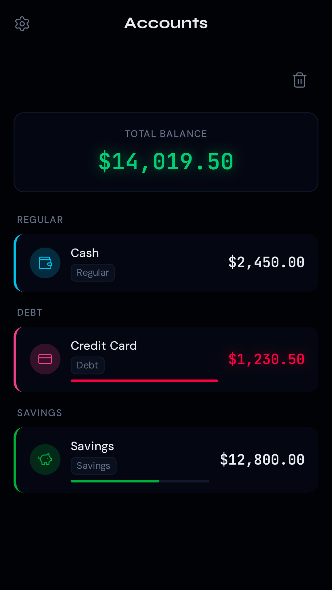
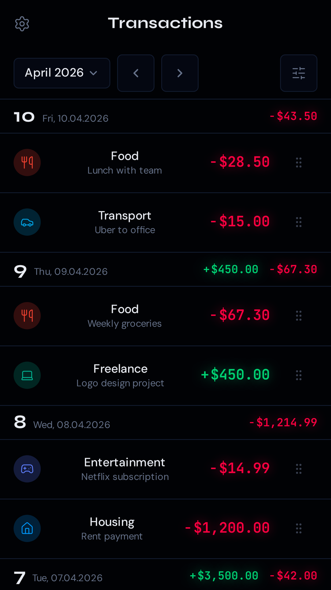
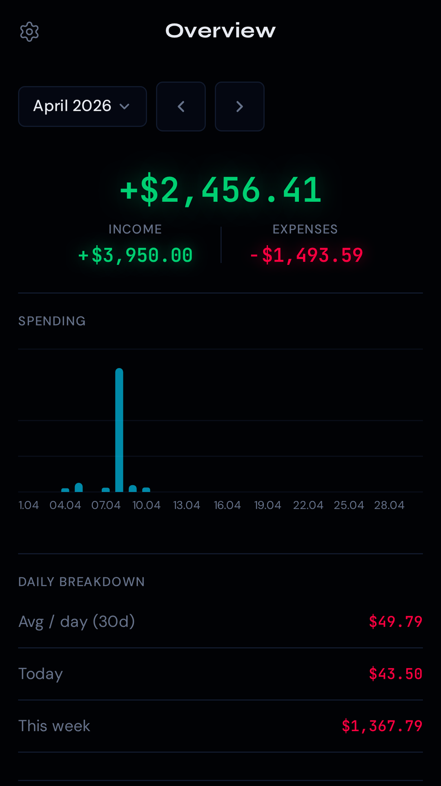

# Expenses App

A personal finance tracking **Progressive Web App** built with React 19, TypeScript, and Tailwind CSS 4. Designed as a mobile-first Android PWA with full offline support — no server, no account, no cloud.

## Screenshots

<table>
  <tr>
    <td></td>
    <td></td>
    <td></td>
  </tr>
  <tr>
    <td align="center">Accounts</td>
    <td align="center">Transactions</td>
    <td align="center">Overview</td>
  </tr>
</table>

## Features

- **Accounts** — track multiple accounts (cash, bank, crypto, savings) with real-time balances
- **Transactions** — income, expenses, and transfers with category tagging and bulk edit
- **Categories** — custom categories with budgets and an interactive donut chart breakdown
- **Budget** — monthly budget tracking per category with visual progress bars
- **Overview** — spending trends, daily averages, and per-category breakdowns
- **Multi-currency** — live exchange rates with per-account currency and automatic conversion
- **Debt tracking** — mortgage and loan tracking with overpayment info and term recalculation
- **Offline-first** — all data stored locally in IndexedDB via Dexie, no server required
- **PWA** — installable on Android, works without internet, full-screen app experience
- **Backup / Export** — export transactions to XLSX, full data backup and restore

## Tech Stack

| Layer       | Library                       |
| ----------- | ----------------------------- |
| UI          | React 19 + TypeScript 6       |
| Build       | Vite 8 + Tailwind CSS 4       |
| Routing     | React Router 7                |
| Database    | Dexie 4 (IndexedDB)           |
| State       | Zustand 5                     |
| Charts      | Recharts 3 + custom SVG donut |
| Drag & drop | dnd-kit                       |
| i18n        | i18next 26                    |
| Validation  | Zod 4                         |
| PWA         | vite-plugin-pwa + Workbox     |

## Getting Started

```bash
npm install
npm run dev       # http://localhost:5173
```

Or with [Task](https://taskfile.dev):

```bash
task setup        # npm install + Playwright browsers
task dev
```

## Scripts

| Command             | Description                                   |
| ------------------- | --------------------------------------------- |
| `npm run dev`       | Development server with HMR                   |
| `npm run build`     | TypeScript check + production build → `dist/` |
| `npm test`          | Vitest unit tests                             |
| `npm run test:e2e`  | Playwright end-to-end tests                   |
| `npm run lint`      | ESLint                                        |
| `npm run format`    | Prettier (auto-fix)                           |
| `task ci`           | Full CI pass: lint → test → build             |
| `task format:check` | Check formatting without writing              |
| `task docker:up`    | Run in Docker (nginx, port 80)                |

## Pre-commit Hooks

Formatting and lint-fix run automatically on staged files via **husky** + **lint-staged**. No manual step needed — commit as usual.

## Docker

A multi-stage Docker image (Node builder → nginx runtime) is included.

```bash
task docker:build   # build image
task docker:up      # start at http://localhost:80
task docker:down    # stop
```

## Docs

| File                                                   | Contents                                    |
| ------------------------------------------------------ | ------------------------------------------- |
| [`docs/test-plan.md`](docs/test-plan.md)               | 77 manual smoke test cases (TC-001–TC-076)  |
| [`docs/deployment-setup.md`](docs/deployment-setup.md) | Cloudflare Tunnel + Docker deployment guide |
| [`docs/archive/`](docs/archive/)                       | Initial planning specs (may be outdated)    |

## Built with Claude Code

The frontend UI — components, animations, data flows, and overall architecture — was developed using [Claude Code](https://claude.ai/code) with a variety of skills and agents. It turned out pretty well.

## License

MIT
