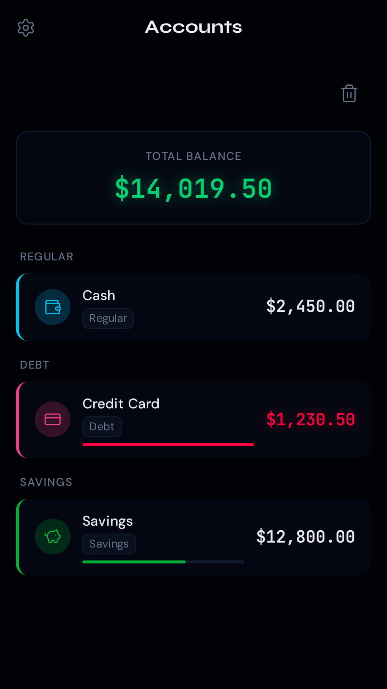
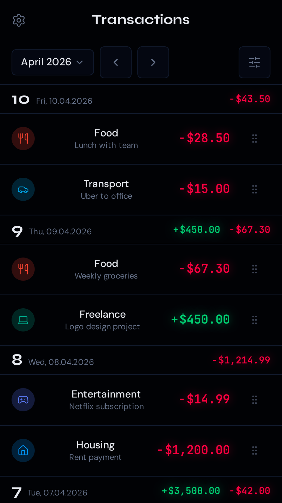
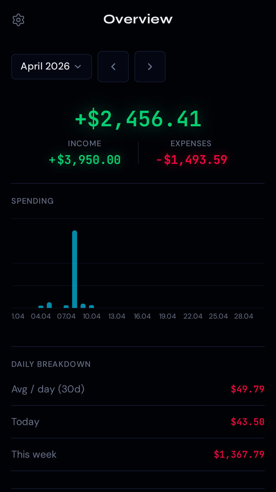

# Expenses App

A personal finance tracking **Progressive Web App** with end-to-end encrypted family sync.

The frontend is a React 19 PWA that works fully offline against a local IndexedDB. An optional Go backend brokers **E2E-encrypted** sync between devices and family members — the server stores opaque ciphertext + AAD metadata only and never sees plaintext financial data. Sign in with Google to share a household; stay signed-out to use the app purely on-device.

## Screenshots

<table>
  <tr>
    <td></td>
    <td></td>
    <td></td>
  </tr>
  <tr>
    <td align="center">Accounts</td>
    <td align="center">Transactions</td>
    <td align="center">Overview</td>
  </tr>
</table>

## Features

- **Accounts** — cash, bank, crypto, savings, and debt/mortgage accounts with stored real-time balances
- **Transactions** — income, expense, and transfer records with category tagging, note search, and bulk operations
- **Categories** — custom categories with drag-reorder, budgets, and an interactive donut breakdown
- **Budget** — monthly budget tracking per category and debt account
- **Overview** — spending trends, daily averages, per-category breakdowns
- **Multi-currency** — live FX rates (open.er-api.com, 24h cache) with per-account currency
- **Debt tracking** — mortgage / loan tracking with payment-split and overpayment term-saved calculator
- **Offline-first** — every screen works without network; IndexedDB is the source of truth
- **PWA** — installable on Android / desktop, full-screen, service-worker cached
- **Backup / Export** — XLSX export, full JSON backup/restore, scheduled auto-backup
- **Onboarding** — first-run flow for currency, first account, seed categories, install prompt
- **Google sign-in** — optional account linking; sign-out leaves all local data intact
- **Family sharing** — invite members to a household; shared accounts, categories, budgets, transactions
- **E2E-encrypted sync** — XChaCha20-Poly1305 record envelopes with a per-family key wrapped to each device's X25519 public key; server stores ciphertext + AAD metadata only
- **Web Push** — per-device push notifications for sync activity and reminders
- **Admin panel** — `/admin` route for user list management (suspend/unsuspend, promote/demote admin), email allowlist, device revocation, and audit log
- **Snapshots & recovery** — server-side ciphertext snapshots; full restore flow for re-installs or new devices

## Tech Stack

### Frontend (`src/`)

| Layer       | Library                             |
| ----------- | ----------------------------------- |
| UI          | React 19 + TypeScript 6             |
| Build       | Vite 8 + Tailwind CSS 4             |
| Routing     | React Router 7                      |
| Database    | Dexie 4 (IndexedDB)                 |
| State       | Zustand 5                           |
| Charts      | Recharts 3 (bar) + custom SVG donut |
| Drag & drop | dnd-kit 6/10                        |
| i18n        | i18next 26 (English only)           |
| Validation  | Zod 4                               |
| PWA         | vite-plugin-pwa 1 + Workbox 7       |
| Unit tests  | Vitest 4 + Testing Library          |
| E2E tests   | Playwright (Pixel 7 device)         |

### Backend (`backend/`)

| Layer         | Library                                                                 |
| ------------- | ----------------------------------------------------------------------- |
| Runtime       | Go 1.26                                                                 |
| HTTP router   | chi v5                                                                  |
| Database      | SQLite (modernc.org/sqlite, WAL, single-writer)                         |
| Query codegen | sqlc                                                                    |
| Migrations    | pressly/goose                                                           |
| Crypto        | libsodium-compatible NaCl primitives via `golang.org/x/crypto`          |
| Auth          | Google ID token verification (`google.golang.org/api`); session cookies |
| Push          | webpush-go (VAPID)                                                      |
| Config        | caarlos0/env v11                                                        |
| IDs / time    | UUID v7 (`google/uuid`); RFC3339+ms wire times                          |

## Getting Started

### Frontend (offline-only mode)

```bash
npm install
npm run dev       # http://localhost:5173
```

The app opens to the configured startup tab (default: Transactions). On first launch a 6-step onboarding flow picks the currency, creates an account, and seeds categories. Sync features are gated behind Google sign-in and a configured backend URL.

### Backend

```bash
cd backend
go run ./cmd/api
```

Config comes from env vars (see `backend/CLAUDE.md` and `docs/backend/operator-runbook.md`). The backend exposes `/v1/*` and an `/admin` UI for family/device administration.

### Task runner

With [Task](https://taskfile.dev):

```bash
task setup        # npm install + Playwright browsers
task ci           # lint -> test -> build
task docker:up    # nginx-served frontend on http://localhost:80
```

## Scripts

| Command               | Description                                            |
| --------------------- | ------------------------------------------------------ |
| `npm run dev`         | Frontend dev server with HMR (http://localhost:5173)   |
| `npm run build`       | TypeScript check + production build → `dist/`          |
| `npm run preview`     | Serve production build locally (http://localhost:4173) |
| `npm test`            | Vitest unit tests                                      |
| `npm run test:e2e`    | Playwright end-to-end tests (auto-starts dev server)   |
| `npm run lint`        | ESLint                                                 |
| `npm run format`      | Prettier (auto-fix)                                    |
| `npm run screenshots` | Regenerate PWA screenshot assets                       |
| `go test ./...`       | Backend tests (from `backend/`)                        |
| `go vet ./...`        | Backend static checks                                  |

## Key concepts

- **Stored balances, not derived.** `balance.service.ts` updates account balances atomically on every add/edit/delete.
- **Minor units everywhere.** All money is integer cents/pence on the wire and in storage. Division by 100 happens only at display time.
- **Soft delete only.** Domain records set `isTrashed = true`. Trash views exist for accounts and categories.
- **E2E envelope.** Records leave the device as `XChaCha20-Poly1305` ciphertext bound to AAD (familyId, recordId, version). The backend persists the envelope verbatim — it cannot decrypt.
- **Trust on first use (TOFU).** Device public keys are pinned the first time a peer signs in; subsequent rotations require explicit re-trust. See `docs/design-notes/key-rotation.md`.

## State management layers

1. **Dexie + useLiveQuery** — reactive DB reads for all domain data (the Dexie schema is versioned in `src/db/database.ts`; see `src/db/CLAUDE.md` for the current head version).
2. **Zustand `ui-store`** — ephemeral UI state (filters, selection, edit mode); lost on reload.
3. **Zustand `settings-store`** — hydrated from DB on startup, written back on change.
4. **Sync engine (`src/services/sync/`)** — outbox + cursor tables drain to the backend in the background; conflicts resolved by `(updatedAt, recordId)` last-writer-wins per architecture spec.

## Testing

```bash
npm test                # frontend unit tests (Vitest)
npm run test:e2e        # frontend e2e (Playwright, Pixel 7)
go test ./... -C backend # backend tests (unit + integration)
```

Manual smoke tests live in `docs/test-plan.md` and run via the `/smoke-test` Claude Code slash command (Playwright MCP, 390×844 viewport).

## Docker

A multi-stage frontend image (Node builder → nginx runtime) and a backend `Dockerfile` are included.

```bash
task docker:build   # build frontend image
task docker:up      # start frontend at http://localhost:80
task docker:down    # stop
task docker:logs    # tail container logs
task docker:rebuild # rebuild + restart
```

See `docs/deployment-setup.md` for the full Cloudflare Tunnel + Docker production stack (frontend + backend + auth env vars).

## Docs

| File                                                                     | Contents                                                                       |
| ------------------------------------------------------------------------ | ------------------------------------------------------------------------------ |
| [`ARCHITECTURE.md`](ARCHITECTURE.md)                                     | Top-level architecture: data model, sync protocol, trust model, threat surface |
| [`docs/deployment-setup.md`](docs/deployment-setup.md)                   | Production deployment guide (Cloudflare Tunnel + Docker + backend env)         |
| [`docs/backend/operator-runbook.md`](docs/backend/operator-runbook.md)   | Day-2 ops: env vars, snapshots, key rotation, incident playbooks               |
| [`docs/backend/architecture.md`](docs/backend/architecture.md)           | Backend-internal architecture (routes, packages, DB schema)                    |
| [`docs/design-notes/key-rotation.md`](docs/design-notes/key-rotation.md) | Work-in-progress design for device-key rotation and re-trust                   |
| [`docs/test-plan.md`](docs/test-plan.md)                                 | Manual smoke test cases                                                        |
| [`CLAUDE.md`](CLAUDE.md)                                                 | Repo-wide agent context: conventions, constraints, patterns                    |
| [`backend/CLAUDE.md`](backend/CLAUDE.md)                                 | Backend package conventions and gotchas                                        |
| [`src/db/CLAUDE.md`](src/db/CLAUDE.md)                                   | Dexie schema rules and migration conventions                                   |
| [`src/services/CLAUDE.md`](src/services/CLAUDE.md)                       | Service-layer overview                                                         |
| [`src/services/auth/CLAUDE.md`](src/services/auth/CLAUDE.md)             | Google sign-in + session handling                                              |
| [`src/services/crypto/CLAUDE.md`](src/services/crypto/CLAUDE.md)         | Crypto worker, key material, envelope format                                   |
| [`src/services/sync/CLAUDE.md`](src/services/sync/CLAUDE.md)             | Outbox / cursor sync engine                                                    |
| [`src/services/family/CLAUDE.md`](src/services/family/CLAUDE.md)         | Family membership and invite flow                                              |
| [`src/components/CLAUDE.md`](src/components/CLAUDE.md)                   | Component conventions                                                          |
| [`src/hooks/CLAUDE.md`](src/hooks/CLAUDE.md)                             | Reactive hook conventions                                                      |
| [`src/utils/CLAUDE.md`](src/utils/CLAUDE.md)                             | Pure-utility conventions                                                       |

## Built with Claude Code

Most of this codebase — frontend UI, backend handlers, sync protocol, and tests — was developed using [Claude Code](https://claude.ai/code) with a variety of skills and subagents.

## License

MIT
